# Active-Directory-Homelab – Teil 1: Aufbau und Absicherung

Eine kleine Windows-Domäne auf meinem Proxmox-Server: ein Domänencontroller, ein Client und ein paar Test-Benutzer.
Ziel war, eine vorhandene, unaufgeräumte Testumgebung so herzurichten, wie man sie in einer kleinen Firma erwarten würde – und jeden Schritt aus Admin- **und** Benutzersicht zu prüfen.

> **Hinweis zur Entstehung:** Das Projekt habe ich Schritt für Schritt mit einer KI (Claude) als Lernbegleitung erarbeitet. Die KI hat erklärt, geprüft und Fehler aufgezeigt – alle Schritte habe ich selbst am System durchgeführt und getestet. Die Screenshots stammen aus meiner Umgebung.

**Weiter zu Teil 2:** [Ticket-Simulation](TEIL-2-TICKETS.md) – typische Service-Desk-Fälle in dieser Umgebung.

---

## Inhalt
1. [Umgebung](#1-umgebung)
2. [Ausgangslage](#2-ausgangslage)
3. [Fernzugriff per RDP](#3-fernzugriff-per-rdp)
4. [Client in die richtige OU](#4-client-in-die-richtige-ou)
5. [Gruppen statt Einzelrechte](#5-gruppen-statt-einzelrechte)
6. [Freigabe IT-Daten absichern](#6-freigabe-it-daten-absichern)
7. [Gruppenrichtlinien: eine GPO, ein Zweck](#7-gruppenrichtlinien-eine-gpo-ein-zweck)
8. [Kennwortregeln und Kontosperrung](#8-kennwortregeln-und-kontosperrung)
9. [Aufräumen](#9-aufräumen)
10. [Snapshots und Backups](#10-snapshots-und-backups)
11. [Testergebnisse](#11-testergebnisse)
12. [Fehler, aus denen ich gelernt habe](#12-fehler-aus-denen-ich-gelernt-habe)

---

## 1. Umgebung

| Komponente | Details |
|---|---|
| Host | Mini-PC, Intel i5-8400T, 8 GB RAM, 256 GB SSD, Proxmox VE |
| Domänencontroller | `DCTEST`, Windows Server 2025, feste IP `192.168.2.10`, Domäne `labor.test` |
| Client | `CL-01`, Windows Server 2025 in der Rolle eines Arbeitsplatz-PCs, `192.168.2.11`, DNS zeigt auf den DC |
| Sonstiges | AdGuard (DNS/DHCP fürs Heimnetz), Home Assistant, zwei Linux-Container |

```
labor.test
├── DCTEST (192.168.2.10)   Server mit dem Active Directory
│    └── IT-Unternehmen
│         ├── Benutzer   TU, John Doe, Anna Schmidt, Erika/Max Mustermann, Leon Mueller
│         ├── Computer   CL-01
│         ├── Gruppen    GG-IT, GG-Buchhaltung, GG-Azubis, IT-Administratoren
│         └── Server
└── CL-01 (192.168.2.11)    Arbeitsplatz-PC, meldet sich beim DC an
```

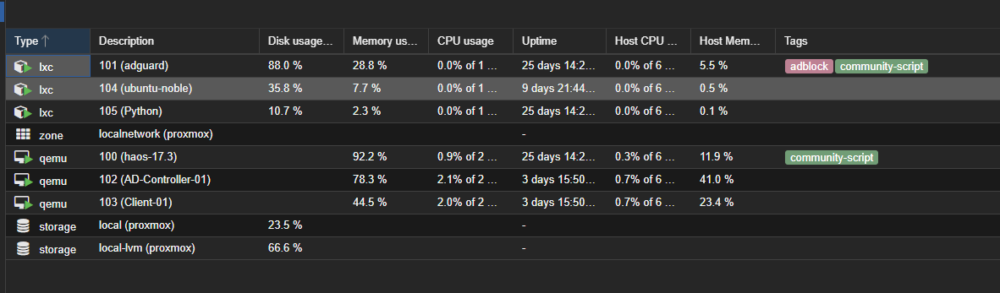

Der Arbeitsspeicher ist mit 8 GB knapp – bei laufendem DC und Client ist der Host zu gut 80 % ausgelastet.

---

## 2. Ausgangslage

Die Domäne existierte schon aus einem früheren Versuch. Eine Bestandsaufnahme zeigte:

- Der Client lag im Standard-Container **Computers** – dort greifen keine Gruppenrichtlinien.
- Eine Kennwort-GPO hing an einer OU, in der nur eine Gruppe lag. Sie hatte **keine Wirkung**.
- Die Freigabe **IT-Daten** war für **alle** Domänenbenutzer offen.
- Der Test-Benutzer steckte in Admin- und Remotedesktop-Gruppen, die er nicht braucht.
- Eine „Azubi“-GPO sperrte die Systemsteuerung für **alle** Benutzer, nicht nur für Azubis.
- Eine weitere GPO war nirgends verknüpft (Überbleibsel).

---

## 3. Fernzugriff per RDP

Ich wollte vom DC per Remotedesktop auf den Client. Das schlug mit Fehler **0x204** fehl.

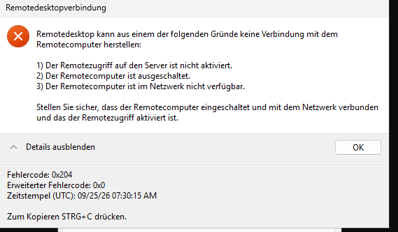

Fehlersuche von unten nach oben:
1. **DNS:** Der Name `CL-01` wurde korrekt zu `192.168.2.11` aufgelöst.
2. **Erreichbarkeit:** Ping schlug fehl – bei Windows-Clients blockt die Firewall Ping aber standardmäßig, das allein sagt nichts.
3. **Port 3389:** geschlossen.
4. **Ursache:** RDP war auf dem Client deaktiviert und die Firewall-Regel aus.

Lösung per Fernwartung (PowerShell Remoting) vom DC aus: RDP aktiviert, Firewall-Regeln für RDP und Ping freigegeben, Test-Benutzer in die **lokale** Gruppe Remotedesktopbenutzer auf CL-01 aufgenommen. Danach war Port 3389 offen und die Verbindung klappte.

---

## 4. Client in die richtige OU

`Computers` sieht aus wie ein Ordner, ist aber ein **Container** – daran lassen sich keine GPOs verknüpfen. CL-01 wurde deshalb in die OU **IT-Unternehmen → Computer** verschoben.

Für diesen Schritt wichtig: Die Einstellungen einer GPO sind in zwei Bereiche aufgeteilt (dazu kommen weitere Teile wie Verknüpfungen, Sicherheitsfilterung und Delegierung, siehe Abschnitt 7).
- **Computerkonfiguration** wirkt, wenn das **Computerkonto** in der OU liegt.
- **Benutzerkonfiguration** wirkt, wenn das **Benutzerkonto** in der OU liegt – egal, an welchem PC sich jemand anmeldet.

---

## 5. Gruppen statt Einzelrechte

Rechte werden an **Gruppen** vergeben, nicht an einzelne Personen. Kommt jemand neu in eine Abteilung, reicht die Aufnahme in die Gruppe.

| Gruppe | Mitglieder |
|---|---|
| GG-IT | John Doe |
| GG-Buchhaltung | Anna Schmidt, Erika Mustermann, Test User |
| GG-Azubis | Leon Mueller, Max Mustermann |

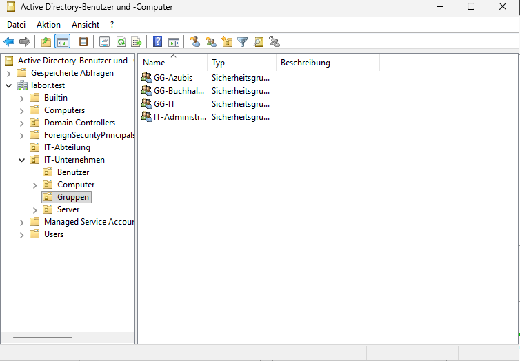

Der Test-Benutzer ist bewusst in der Buchhaltung – so lässt sich prüfen, dass er **nicht** in IT-Bereiche kommt.

---

## 6. Freigabe IT-Daten absichern

Es gibt zwei Ebenen von Rechten: **Freigabe** und **NTFS**. Es gilt immer die strengere. Die Freigabe bleibt offen, gesteuert wird über NTFS:

- Vererbung am Ordner deaktiviert
- Gruppe „Benutzer“ (= alle Domänenbenutzer) entfernt
- **GG-IT** mit **Ändern** hinzugefügt (lesen, schreiben, löschen – aber keine Rechte vergeben)
- Administratoren und SYSTEM behalten Vollzugriff

Geprüft mit dem Reiter **Effektiver Zugriff** in den Ordnereigenschaften:

| John Doe (GG-IT) | Test User (Buchhaltung) |
|---|---|
| 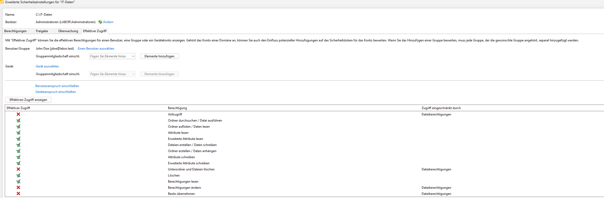 | 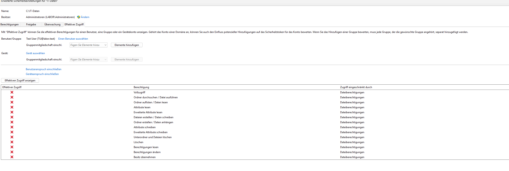 |

Und aus Benutzersicht am Client:

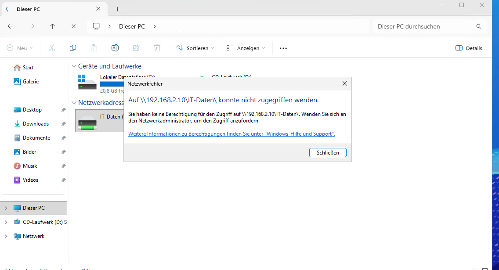

---

## 7. Gruppenrichtlinien: eine GPO, ein Zweck

Die alte „Azubi“-GPO enthielt zwei Dinge: die Systemsteuerungs-Sperre **und** das Netzlaufwerk Z:. Hätte man sie nur auf Azubis gefiltert, hätte ausgerechnet die IT ihr Laufwerk verloren. Deshalb aufgeteilt:

| GPO | Inhalt | Gilt für |
|---|---|---|
| GPO_Azubi_Sperren | Systemsteuerung und Einstellungen sperren | GG-Azubis |
| GPO-Laufwerk-IT-Daten | Z: → `\\DCTEST\IT-Daten` (Name statt IP) | GG-IT |

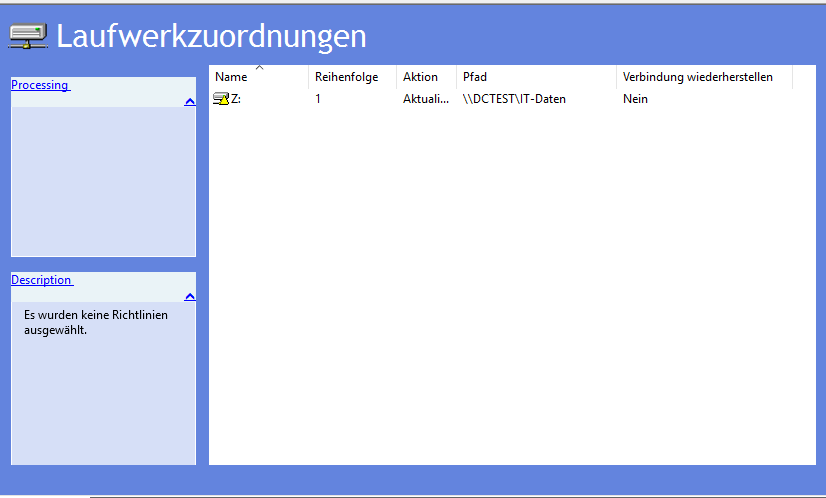

Mit der **Sicherheitsfilterung** wirkt eine GPO nur für bestimmte Gruppen innerhalb der OU. Stolperstein: „Authentifizierte Benutzer“ müssen die GPO trotzdem **lesen** dürfen (Reiter Delegierung), sonst wirkt sie bei niemandem.

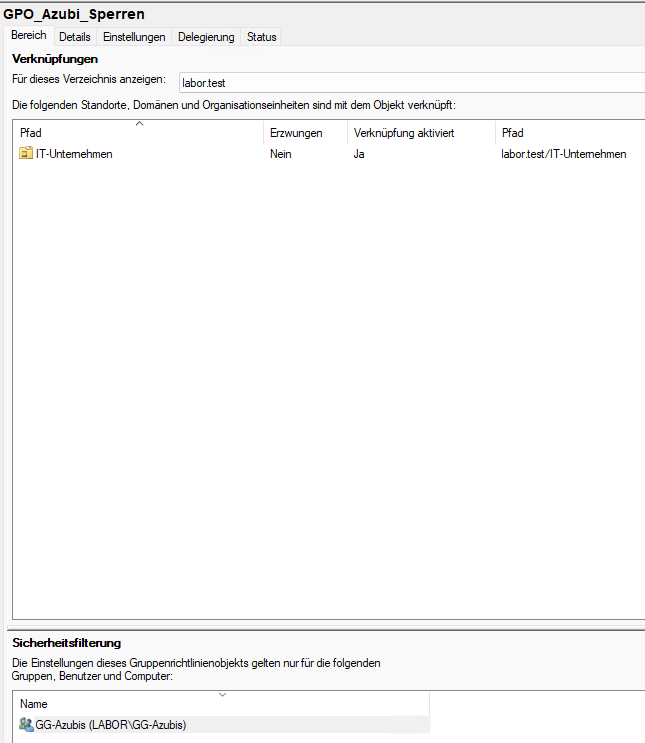

Test mit drei Benutzern auf CL-01 (jeweils neu angemeldet):

| John Doe (IT) – hat Z: | Leon Mueller (Azubi) – kein Z:, Systemsteuerung gesperrt |
|---|---|
| 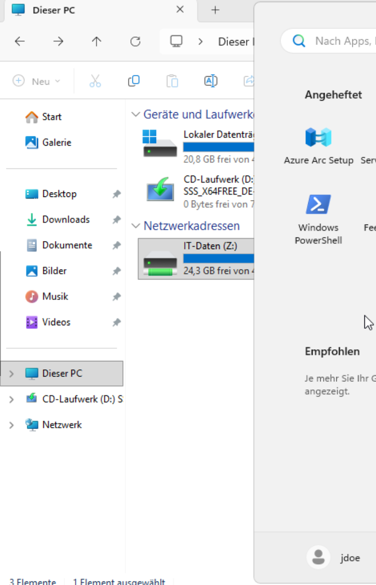 | 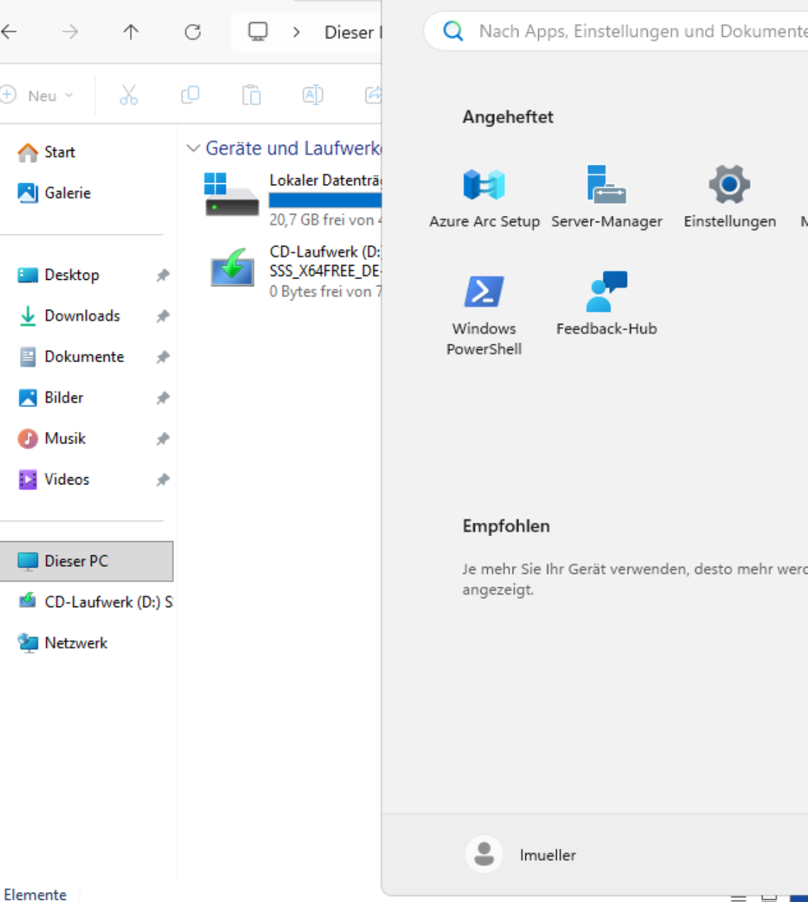 |

---

## 8. Kennwortregeln und Kontosperrung

Kennwortregeln für Domänenkonten wirken **nur auf Domänenebene** (Default Domain Policy) – deshalb war die alte OU-Kennwort-GPO wirkungslos. Die Standardwerte: mind. 7 Zeichen, Komplexität, Wechsel alle 42 Tage, 24 Kennwörter Chronik.

Die **Kontosperrung** war aus (Schwelle 0 = nie sperren). Neu eingestellt:

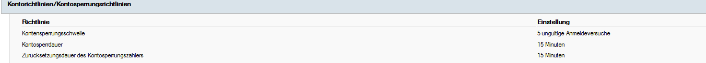

5 Fehlversuche → 15 Minuten gesperrt; nach 15 Minuten ohne Fehler zählt der Zähler neu.

Getestet: Test User fünfmal mit falschem Kennwort – beim sechsten Mal mit richtigem Kennwort ist das Konto gesperrt. Danach im AD entsperrt, **ohne** das Kennwort zurückzusetzen (der Benutzer kennt es ja).

| Benutzersicht | Service-Desk-Sicht |
|---|---|
| 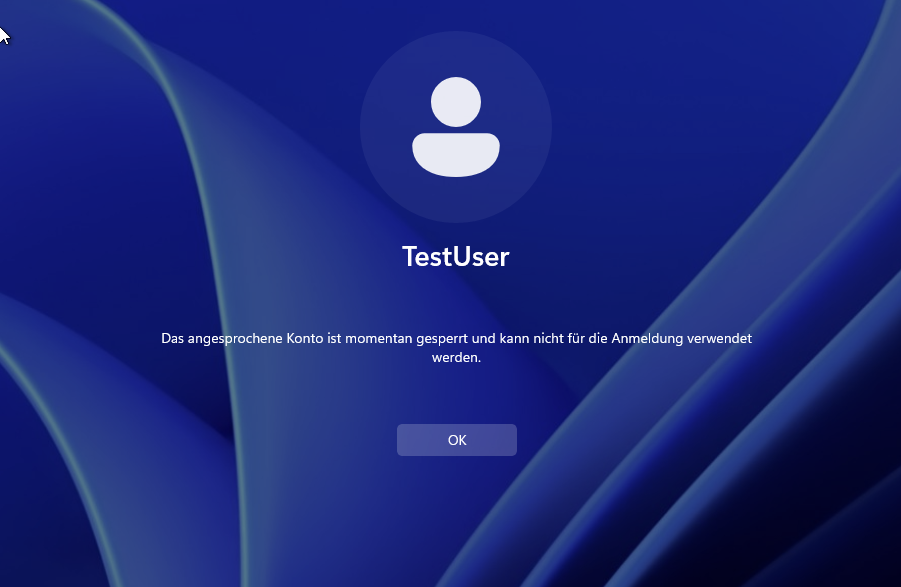 | 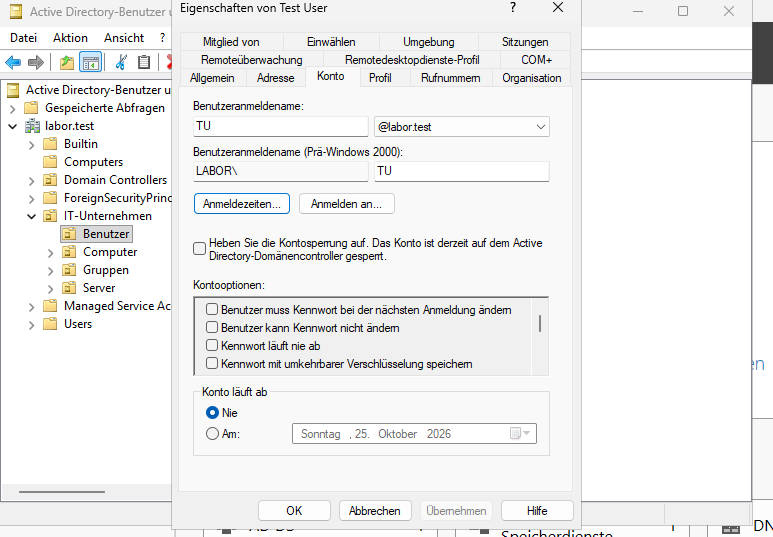 |

---

## 9. Aufräumen

- Test User aus **IT-Administratoren** und der Domänengruppe **Remotedesktopbenutzer** entfernt – er ist jetzt nur noch in Domänen-Benutzer und GG-Buchhaltung.
- Gruppe IT-Administratoren in die OU Gruppen verschoben.
- Leere OU **IT-Abteilung** und die wirkungslose Kennwort-GPO gelöscht.
- Nicht verknüpfte GPO **GPO_Einschränkungen_IT** geprüft: Sie war eine Doublette der Azubi-Sperre – gelöscht. Vorher immer prüfen: Wo ist sie verknüpft, was steht drin?

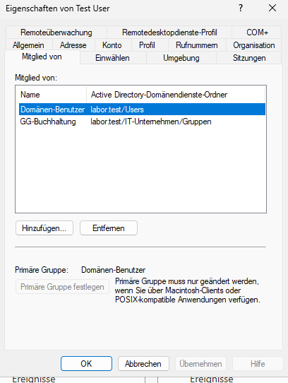

---

## 10. Snapshots und Backups

- **Snapshot** = schneller Rückgängig-Knopf, liegt auf derselben Platte wie die VM.
- **Backup** = eigenständige Datei, übersteht auch das Löschen der VM.

Vor dem Umbau und nach Abschluss wurde je ein Snapshot von DC und Client erstellt, zusätzlich je ein Backup (ZSTD, ca. 15 GB bzw. 18 GB).

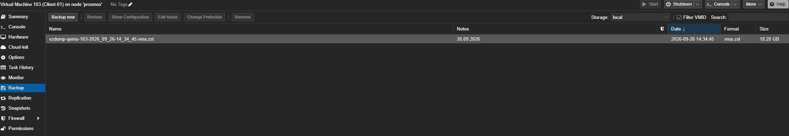

---

## 11. Testergebnisse

| Test | Erwartet | Ergebnis |
|---|---|---|
| RDP vom DC auf CL-01 | Verbindung | ✅ |
| TU öffnet Z: bzw. IT-Daten | Zugriff verweigert | ✅ |
| Effektiver Zugriff jdoe / TU | Ändern / nichts | ✅ |
| jdoe, TU, lmueller am Client: Laufwerk Z: | nur jdoe | ✅ |
| lmueller: Systemsteuerung | gesperrt | ✅ |
| TU: Systemsteuerung | erlaubt, Systemänderungen nur mit Admin-Kennwort | ✅ |
| 5 falsche Kennwörter | Konto gesperrt | ✅ |
| Sperre im AD aufheben | Anmeldung wieder möglich | ✅ |
| Backups DC und Client | erstellt | ✅ |

---

## 12. Fehler, aus denen ich gelernt habe

- **Falscher Ort:** Beim Ändern der Ordnerrechte war ich zuerst in den Rechten von ganz `C:\` statt von `C:\IT-Daten`. Bemerkt, bevor etwas geändert wurde. Seitdem prüfe ich vor jeder Rechteänderung das Feld **Name** oben im Fenster.

  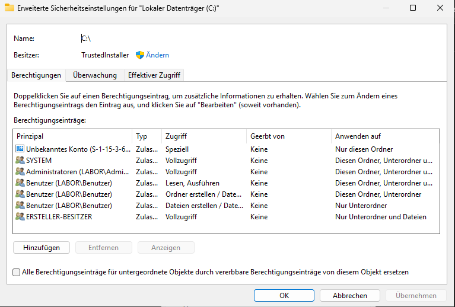

- **Nur Lesen statt Ändern:** Beim Hinzufügen einer Gruppe setzt Windows standardmäßig nur „Lesen, Ausführen“ – „Ändern“ muss man selbst anhaken.
- **Falsche Gruppe gefiltert:** Die Azubi-GPO war zuerst auf GG-IT gefiltert. Eine Verwechslung, die keine Fehlermeldung erzeugt – man merkt sie erst, wenn sich jemand beschwert.
- **Kennung verschrieben:** `lmueller` beginnt mit einem kleinen L, nicht mit einem großen i – ein Klassiker bei Anmeldeproblemen.

---

## Weitere Screenshots

Alle Nachweise liegen im Ordner [`screenshots/`](screenshots/). Eine Übersicht, welches Bild was zeigt, steht in [SCREENSHOTS.md](SCREENSHOTS.md).
