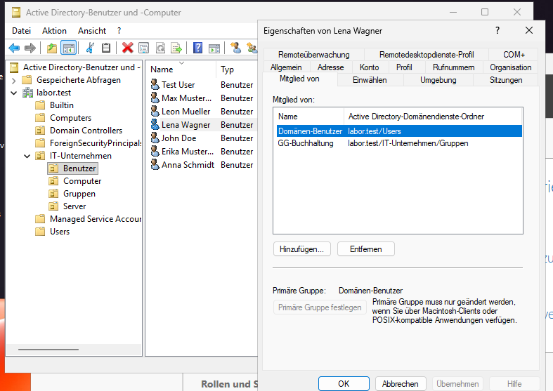
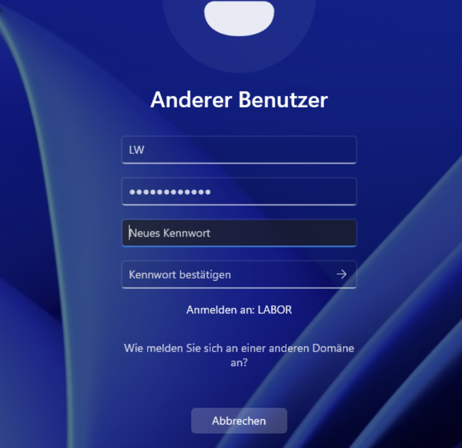
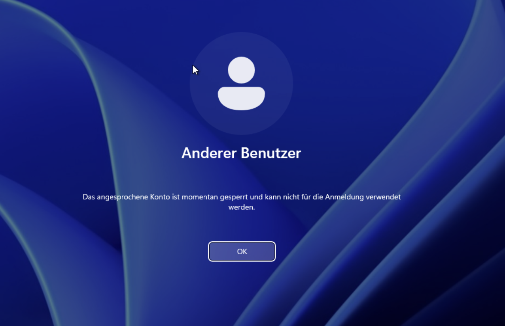
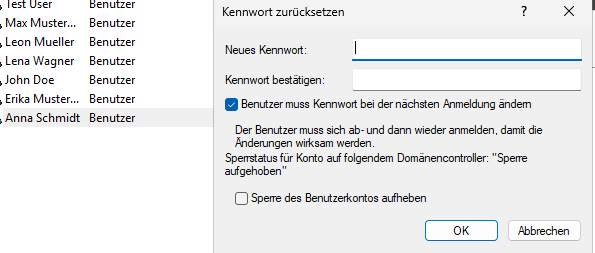
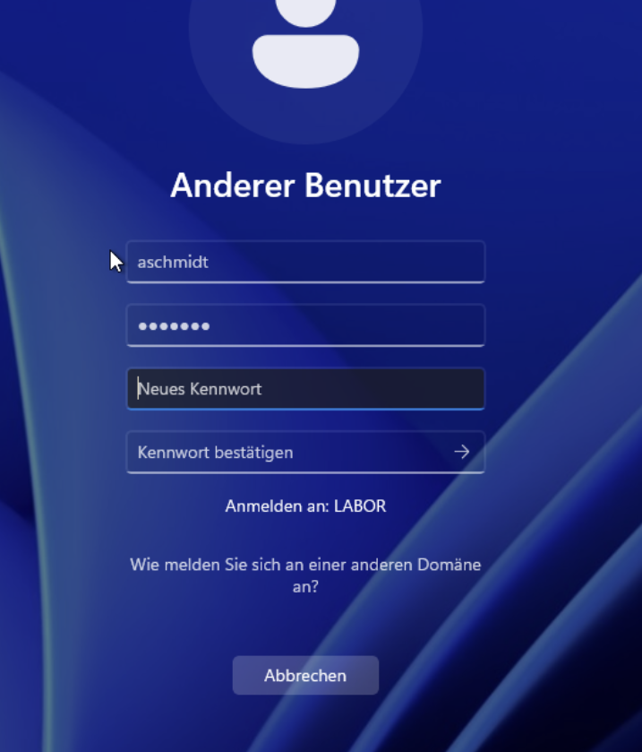
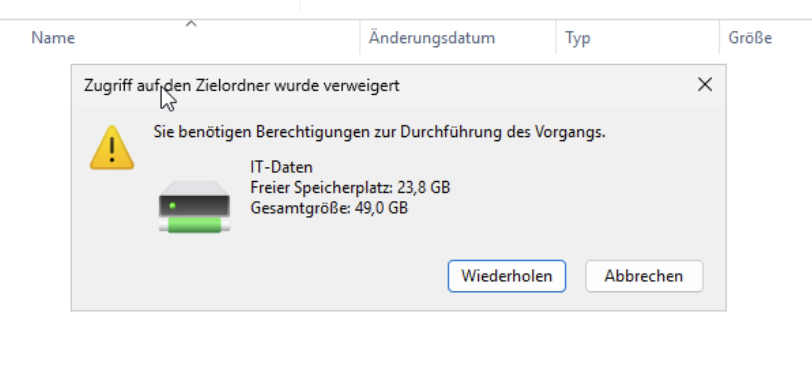
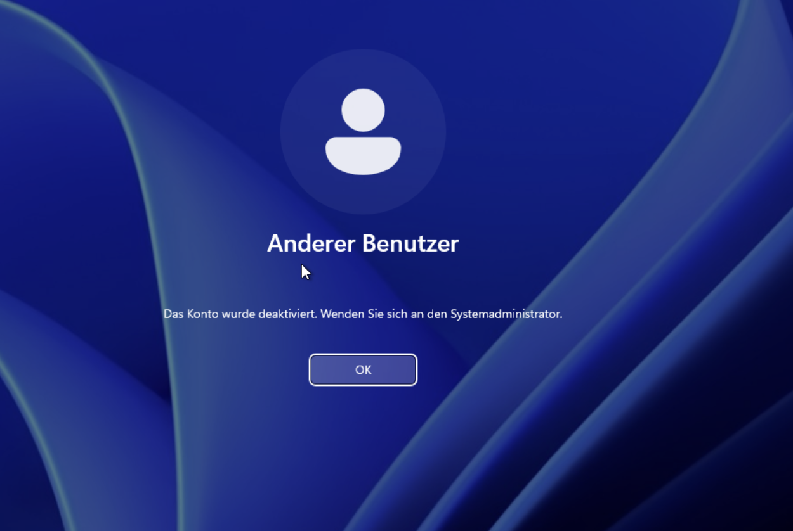
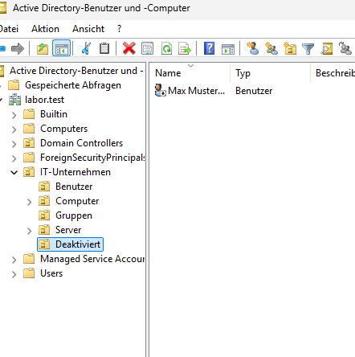

# Active-Directory-Homelab – Teil 2: Ticket-Simulation

In Teil 2 bearbeite ich in meiner Testdomäne typische Service-Desk-Anfragen: Eintritt, Kennwort, Zugriff, Austritt.
Jedes Ticket ist gleich aufgebaut: Anfrage, Umsetzung, Prüfung.

Der Aufbau der Umgebung steht in [Teil 1](README.md).

> **Hinweis zur Entstehung:** Die Tickets hat mir eine KI (Claude) als Lernbegleitung gestellt und meine Lösungen geprüft. Umgesetzt und getestet habe ich alles selbst am System.

---

## Ticket 001 – Neue Mitarbeiterin

**Anfrage:** Lena Wagner fängt in der Buchhaltung an und braucht ein Benutzerkonto.

**Umsetzung:**
- Konto in der OU *Benutzer* angelegt, Anmeldename `lwagner` (gleiches Schema wie die anderen Konten).
- In die Gruppe `GG-Buchhaltung` aufgenommen.
- „Benutzer muss Kennwort bei der nächsten Anmeldung ändern“ gesetzt.

**Prüfung:** Anmeldung am Client mit dem Startkennwort – die Aufforderung zur Kennwortänderung erscheint.

| Gruppen im AD | Erstanmeldung am Client |
|---|---|
|  |  |

Das Konto hatte ich zuerst mit dem Kürzel `LW` angelegt (im Bild noch zu sehen) und danach an das Namensschema angepasst.

---

## Ticket 002 – Konto gesperrt, Kennwort vergessen

**Anfrage:** Anna Schmidt ruft an, sie kommt nach dem Urlaub nicht mehr in ihren PC.

**Umsetzung:**
- Identität der Anruferin geprüft.
- Fehlermeldung erfragt: Konto gesperrt.
- Nachgefragt, ob sie ihr Kennwort noch kennt – nein. Deshalb reicht Entsperren allein nicht.
- Im AD: Kennwort zurückgesetzt, Sperre aufgehoben, Kennwortwechsel bei der nächsten Anmeldung erzwungen.

**Prüfung:** Anmeldung am Client mit dem Startkennwort – die Aufforderung zur Kennwortänderung erscheint.

| Meldung am Client | Zurücksetzen im AD |
|---|---|
|  |  |

Gelernt: Der Haken „muss Kennwort ändern“ setzt kein neues Kennwort. Wer das alte vergessen hat, braucht zusätzlich einen Reset.

---

## Ticket 003 – Lesezugriff auf einen Ordner

**Anfrage:** Lena Wagner braucht eine Vorlage aus dem Ordner *IT-Daten*, der nur für die IT freigegeben ist. Die IT-Leitung genehmigt Lesezugriff.

**Umsetzung:**
- Neue Gruppe `GG-IT-Daten-Lesen` angelegt, Lena als Mitglied.
- Am Ordner: Gruppe mit **Lesen, Ausführen** berechtigt (NTFS).
- In der Laufwerks-GPO die Gruppe zur Sicherheitsfilterung hinzugefügt, damit Laufwerk Z: bei ihr erscheint.

**Prüfung:** Lena sieht Z: und kann Dateien öffnen. Eine neue Datei anzulegen wird verweigert.

Gelernt: Die GPO regelt nur, ob das Laufwerk **angezeigt** wird. Ob jemand **hinein darf**, regeln Gruppe und NTFS-Rechte. Eine eigene Gruppe pro Zugriffsart (ändern / nur lesen) hält die Ordnerrechte sauber.

---

## Ticket 004 – Austritt

**Anfrage:** Max Mustermann verlässt das Unternehmen. Zugang sofort sperren, Konto bleibt 30 Tage erhalten.

**Umsetzung:**
- Konto deaktiviert (nicht gelöscht).
- Aus der Abteilungsgruppe entfernt.
- In eine eigene OU `Deaktiviert` verschoben.
- Im Feld *Beschreibung* Austrittsdatum und geplantes Löschdatum vermerkt.

**Prüfung:** Anmeldung am Client wird mit „Das Konto wurde deaktiviert“ abgelehnt.

| Meldung am Client | OU Deaktiviert |
|---|---|
|  |  |

Gelernt: Eine OU ist der **Ort**, an dem ein Konto liegt. Eine Gruppe ist eine **Mitgliedschaft**. Zum Trennen von aktiven und gesperrten Konten braucht es die OU.

---

Als Nächstes folgen Störungs-Tickets: Etwas funktioniert nicht, und die Ursache muss gefunden werden.
